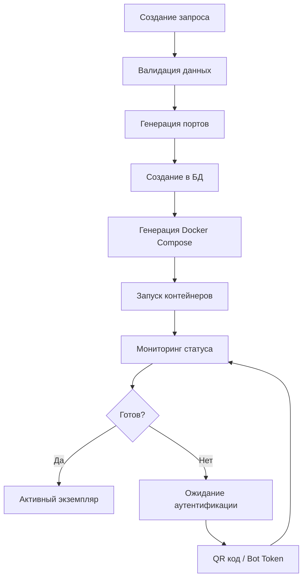

# 🔍 ДЕТАЛЬНЫЙ АНАЛИЗ ПРОЕКТА WWEB-MCP

## 📋 ОБЩАЯ ИНФОРМАЦИЯ О ПРОЕКТЕ

### Название проекта
**Craftify Messengers - WWEB-MCP Integration**

### Версия
**v2.0.6** (на основе package.json и CHANGELOG.md)

### Назначение
Комплексная система для интеграции WhatsApp Web и Telegram с AI моделями через Model Context Protocol (MCP). Поддерживает множественные инстансы, REST API и динамическое управление Docker контейнерами для создания масштабируемых мессенджер-ботов.

### Архитектурный подход
- **Микросервисная архитектура** с Docker контейнерами
- **Multi-provider система** с единым API
- **Instance Manager** для управления экземплярами
- **Database-driven конфигурация** с PostgreSQL/Supabase
- **AI интеграция** через Agno агентную систему

---

## 🏗️ АРХИТЕКТУРА СИСТЕМЫ

### Основные компоненты

```
┌─────────────────────────────────────────────────────────────┐
│                    WWEB-MCP СИСТЕМА                         │
├─────────────────────────────────────────────────────────────┤
│  🎯 Instance Manager (Порт 3000)                           │
│  ├── REST API для управления инстансами                     │
│  ├── Docker Service (создание контейнеров)                  │
│  ├── Database Service (PostgreSQL)                          │
│  └── Health Monitoring                                      │
├─────────────────────────────────────────────────────────────┤
│  📱 WhatsApp Instances (Динамические порты 3001-7999)      │
│  ├── WhatsApp Web Client (puppeteer + whatsapp-web.js)     │
│  ├── REST API (/api/v1/whatsapp)                           │
│  ├── MCP Server интеграция                                 │
│  └── Webhook поддержка                                      │
├─────────────────────────────────────────────────────────────┤
│  💬 Telegram Instances (Динамические порты 4001-8999)      │
│  ├── Telegram Bot (grammY)                                 │
│  ├── REST API (/api/v1/telegram)                           │
│  ├── Bot Token аутентификация                               │
│  └── Webhook поддержка                                      │
├─────────────────────────────────────────────────────────────┤
│  🧠 MCP Server (Динамические порты)                        │
│  ├── Model Context Protocol интеграция                      │
│  ├── AI Tools для WhatsApp и Telegram                      │
│  └── SSE/Command транспорт                                  │
└─────────────────────────────────────────────────────────────┘
```

### Режимы работы

| Режим | Описание | Энтрипоинт | Порт |
|-------|----------|------------|------|
| **Instance Manager** | Управление инстансами | `main-instance-manager.js` | 3000 (фиксированный) |
| **WhatsApp API** | Standalone WhatsApp API | `main.js -m whatsapp-api` | Динамический |
| **Telegram API** | Standalone Telegram API | `main.js -m telegram-api` | Динамический |
| **MCP Server** | AI интеграция | `main.js -m mcp` | Динамический |

---

## 📱 WHATSAPP ФУНКЦИОНАЛ

### Технические характеристики
- **Библиотека**: whatsapp-web.js v1.26.0
- **Браузерный движок**: Puppeteer (Chrome headless)
- **Аутентификация**: QR код сканирование + LocalAuth
- **Хранение сессии**: Локальные файлы в `.wwebjs_auth`

### Основные возможности

#### 🔐 Аутентификация и подключение
- **QR код генерация** - автоматическое создание QR кода для подключения
- **Сохранение сессии** - LocalAuth стратегия для сохранения авторизации
- **Мониторинг состояния** - отслеживание статусов: `QR_READY`, `AUTHENTICATED`, `READY`
- **Автоматическое переподключение** - восстановление соединения при сбоях

#### 💬 Обработка сообщений
- **Входящие сообщения** - получение и обработка всех типов сообщений
- **Исходящие сообщения** - отправка текстовых сообщений
- **Медиа сообщения** - поддержка изображений, документов, аудио
- **Групповые чаты** - полная поддержка групп и управление участниками

#### 📊 API функции
```typescript
// Основные методы WhatsApp провайдера
- sendMessage(to: string, message: string)
- getContacts(query?: string)
- getChats()
- getMessages(chatId: string, limit: number)
- createGroup(name: string, participants: string[])
- addParticipantsToGroup(groupId: string, participants: string[])
- sendMediaMessage(params: SendMediaMessageParams)
- downloadMediaFromMessage(messageId: string)
```

#### 🔄 Event Handlers
- `qr` - генерация QR кода
- `ready` - клиент готов к работе
- `authenticated` - успешная аутентификация
- `message` - входящее сообщение
- `message_create` - исходящее сообщение
- `disconnected` - потеря соединения

### Docker интеграция
- **Headless режим** - работа без GUI в контейнере
- **Volume mapping** - сохранение auth данных
- **Resource limits** - ограничения памяти и CPU
- **Health checks** - мониторинг состояния контейнера

---

## 💬 TELEGRAM ФУНКЦИОНАЛ

### Технические характеристики
- **Библиотека**: grammY v1.36.3 (замена с telegram/GramJS)
- **Аутентификация**: Bot Token через @BotFather
- **API версия**: Telegram Bot API 7.0+
- **Транспорт**: Long Polling / Webhooks

### Основные возможности

#### 🤖 Bot Management
- **Bot Token аутентификация** - простая настройка через токен
- **Bot Info получение** - информация о боте (имя, username, ID)
- **Polling управление** - запуск/остановка получения обновлений
- **Webhook поддержка** - альтернатива polling для production

#### 💬 Обработка сообщений
- **Текстовые сообщения** - полная поддержка Unicode
- **Медиа сообщения** - фото, видео, документы, аудио
- **Групповые чаты** - работа в группах и супергруппах
- **Каналы** - поддержка каналов и их администрирование

#### 📊 API функции
```typescript
// Основные методы Telegram провайдера
- sendMessage(chatId: string, message: string)
- sendTelegramMessage(params: TelegramSendMessageParams)
- sendMediaMessage(params: SendMediaMessageParams)
- getMe() // Информация о боте
- getChats()
- getGroupById(groupId: string)
- startPolling() / stopPolling()
```

#### 🎯 Telegram-специфичные функции
- **Parse Mode** - поддержка Markdown и HTML
- **Reply To Message** - ответы на сообщения
- **Disable Notifications** - тихие уведомления
- **Web Page Preview** - управление превью ссылок

### Event Handlers
- `message` - все входящие сообщения
- `error` - обработка ошибок бота
- Автоматическая обработка всех типов обновлений

---

## 🎛️ INSTANCE MANAGER

### Архитектура управления
Instance Manager - центральный компонент для создания и управления экземплярами мессенджеров.

#### 🏗️ Основные сервисы

##### DatabaseService
- **Подключение к БД** - PostgreSQL/Supabase интеграция
- **CRUD операции** - управление экземплярами в БД
- **Миграции** - автоматическое обновление схемы
- **Connection pooling** - оптимизация подключений

##### DockerService
- **Container management** - создание/удаление контейнеров
- **Compose generation** - динамическая генерация docker-compose.yml
- **Resource monitoring** - отслеживание CPU/Memory
- **Health checks** - проверка состояния сервисов

##### InstanceMonitorService
- **Status tracking** - мониторинг состояния экземпляров
- **Auth status** - отслеживание аутентификации
- **QR code management** - управление QR кодами для WhatsApp
- **Metrics collection** - сбор метрик производительности

#### 🔄 Жизненный цикл экземпляра



#### 📊 API Endpoints
```
GET    /api/v1/instances           - Список экземпляров
POST   /api/v1/instances           - Создание экземпляра
GET    /api/v1/instances/:id       - Информация об экземпляре
DELETE /api/v1/instances/:id       - Удаление экземпляра
POST   /api/v1/instances/:id/start - Запуск экземпляра
POST   /api/v1/instances/:id/stop  - Остановка экземпляра
GET    /api/v1/instances/:id/qr    - QR код (для WhatsApp)
GET    /api/v1/instances/:id/status - Статус экземпляра
```

---

## 🗄️ БАЗА ДАННЫХ

### Схема данных (PostgreSQL)

#### Таблица `public.message_instances`
```sql
CREATE TABLE public.message_instances (
    id UUID PRIMARY KEY DEFAULT gen_random_uuid(),
    user_id TEXT NOT NULL,
    provider TEXT NOT NULL, -- 'whatsappweb', 'telegram'
    type_instance TEXT[] DEFAULT '{"api"}',
    port_api INTEGER,
    port_mcp INTEGER,
    api_key TEXT DEFAULT id::text,
    token TEXT, -- Bot token для Telegram
    api_webhook_schema JSONB DEFAULT '{}',
    mcp_schema JSONB DEFAULT '{}',
    agent_id TEXT, -- ID агента в Agno системе
    agno_enable BOOLEAN DEFAULT true,
    stream BOOLEAN DEFAULT false,
    session_id UUID, -- Идентификатор сессии
    user_id TEXT, -- ID пользователя для Agno
    created_at TIMESTAMP DEFAULT NOW(),
    updated_at TIMESTAMP DEFAULT NOW(),
    auth_status TEXT DEFAULT 'pending',
    account TEXT, -- Информация об аккаунте
    whatsapp_state TEXT,
    last_activity_at TIMESTAMP,
    message_stats JSONB DEFAULT '{}'
);
```

#### Таблица `public.messages`
```sql
CREATE TABLE public.messages (
    id UUID PRIMARY KEY DEFAULT gen_random_uuid(),
    instance_id UUID REFERENCES public.message_instances(id),
    message_id TEXT NOT NULL,
    chat_id TEXT NOT NULL,
    from_number TEXT,
    to_number TEXT,
    message_body TEXT,
    message_type TEXT DEFAULT 'text',
    is_from_me BOOLEAN DEFAULT false,
    is_group BOOLEAN DEFAULT false,
    group_id TEXT,
    contact_name TEXT,
    agent_id TEXT, -- ID агента для сообщения
    session_id UUID, -- Автогенерируемый из agent_id + chat_id
    timestamp BIGINT NOT NULL,
    created_at TIMESTAMP DEFAULT NOW(),
    updated_at TIMESTAMP DEFAULT NOW(),
    UNIQUE(instance_id, message_id)
);
```

#### Индексы для оптимизации
```sql
CREATE INDEX idx_messages_instance_id ON public.messages(instance_id);
CREATE INDEX idx_messages_chat_id ON public.messages(chat_id);
CREATE INDEX idx_messages_timestamp ON public.messages(timestamp);
CREATE INDEX idx_messages_agent_id ON public.messages(agent_id);
CREATE INDEX idx_messages_session_id ON public.messages(session_id);
```

### Миграции
- **001_split_provider_tables.sql** - Разделение таблиц провайдеров
- **002_remove_current_api_key.sql** - Удаление устаревшего поля
- **004_add_session_id_to_messages.sql** - Добавление session_id

---

## 🤖 AGNO ИНТЕГРАЦИЯ

### Архитектура AI интеграции
Система автоматически интегрируется с агентной системой Agno для обработки входящих сообщений через AI.

#### 🔄 Процесс обработки
1. **Входящее сообщение** поступает в WhatsApp/Telegram
2. **Проверка условий**:
   - `AGNO_ENABLED = true` (глобально)
   - `agno_enable = true` (для экземпляра)
   - `agent_id IS NOT NULL` (для экземпляра)
3. **Отправка в Agno**: `POST /v1/playground/agents/{agent_id}/runs`
4. **Получение ответа** от агента
5. **Отправка ответа** пользователю
6. **Сохранение в БД** как исходящее сообщение

#### 🔧 Конфигурация
```typescript
interface AgnoConfig {
  agentId: string;      // ID агента в системе Agno
  enabled: boolean;     // Включение интеграции
  stream: boolean;      // Потоковый режим
  userId?: string;      // ID пользователя
  sessionId?: string;   // ID сессии для группировки
}
```

#### 📡 API запрос к Agno (v2.0.6)
```typescript
// Новый формат multipart/form-data
const formData = new FormData();
formData.append('message', message.trim());
formData.append('stream', config.stream.toString());
formData.append('monitor', 'false');
formData.append('user_id', config.userId);
formData.append('session_id', config.sessionId);

// URL: /v1/playground/agents/{agent_id}/runs
```

#### 🔄 Session Management
- **Детерминированная генерация** session_id из agent_id + chat_id
- **Группировка сообщений** по сессиям для контекста
- **Автоматическое сохранение** session_id в базе данных

---

## 🔧 ТЕХНИЧЕСКИЕ ДЕТАЛИ

### Управление портами
- **Base Port Range**: 3001-7999 (WhatsApp), 4001-8999 (Telegram)
- **Dynamic allocation** - автоматическое назначение свободных портов
- **Port collision detection** - проверка занятости портов
- **Port persistence** - сохранение назначенных портов в БД

### Memory Management
- **Instance Memory Service** - кэширование состояний экземпляров
- **QR Code caching** - временное хранение QR кодов
- **Status tracking** - отслеживание состояний в памяти
- **Resource monitoring** - контроль потребления ресурсов

### Error Handling
- **Graceful degradation** - система продолжает работать при сбоях
- **Retry mechanisms** - автоматические повторы запросов
- **Comprehensive logging** - детальное логирование всех операций
- **Error propagation** - правильная передача ошибок

### Security
- **API Key authentication** - защита API через Bearer токены
- **Instance isolation** - изоляция экземпляров друг от друга
- **Database security** - защищенные подключения к БД
- **Container security** - изолированные Docker контейнеры

---

## 📊 МОНИТОРИНГ И МЕТРИКИ

### Health Checks
- **Container health** - проверка состояния Docker контейнеров
- **API availability** - доступность API endpoints
- **Database connectivity** - подключение к базе данных
- **External services** - доступность Agno и других сервисов

### Performance Metrics
- **Message throughput** - количество обработанных сообщений
- **Response time** - время ответа API
- **Resource usage** - потребление CPU/Memory
- **Error rates** - частота ошибок

### Logging System
- **Structured logging** - JSON формат логов
- **Log levels** - debug, info, warn, error
- **Contextual information** - включение метаданных
- **Log rotation** - автоматическая ротация файлов

---

## 🚀 DEPLOYMENT И PRODUCTION

### Docker Configuration
```yaml
# Основные сервисы
services:
  whatsapp-api:     # WhatsApp экземпляры
  telegram-api:     # Telegram экземпляры  
  mcp-server:       # MCP интеграция
  instance-manager: # Управление экземплярами
```

### Environment Variables
```bash
# Database
DATABASE_URL=postgresql://...
DATABASE_SCHEMA=public

# Ports
BASE_PORT_RANGE_START=3001
BASE_PORT_RANGE_END=7999

# AI Integration
AGNO_API_BASE_URL=http://localhost:8000
AGNO_ENABLED=true

# Telegram
TELEGRAM_BOT_TOKEN=123456789:ABC...
```

### Production Considerations
- **Load balancing** - распределение нагрузки между экземплярами
- **Scaling strategies** - горизонтальное масштабирование
- **Backup procedures** - резервное копирование данных
- **Monitoring setup** - настройка мониторинга production среды

---

## 🔮 ПЛАНЫ РАЗВИТИЯ

### Поддержка новых провайдеров
- **WhatsApp Official API** - интеграция с официальным API
- **Facebook Messenger** - поддержка Facebook сообщений
- **Instagram Direct** - интеграция с Instagram
- **Slack** - корпоративные мессенджеры
- **Discord** - игровые сообщества

### Улучшения функционала
- **Advanced AI features** - расширенные возможности AI
- **Multi-language support** - поддержка множественных языков
- **Analytics dashboard** - панель аналитики
- **Webhook improvements** - улучшенная система webhook'ов

### Технические улучшения
- **Performance optimization** - оптимизация производительности
- **Security enhancements** - улучшения безопасности
- **API versioning** - версионирование API
- **Testing coverage** - расширение тестового покрытия

---

## 📝 ЗАКЛЮЧЕНИЕ

WWEB-MCP представляет собой комплексную и масштабируемую систему для интеграции мессенджеров с AI технологиями. Архитектура системы обеспечивает:

✅ **Гибкость** - поддержка множественных провайдеров и режимов работы  
✅ **Масштабируемость** - динамическое создание экземпляров и управление ресурсами  
✅ **Надежность** - комплексная система мониторинга и обработки ошибок  
✅ **Интеграция** - глубокая интеграция с AI системами через Agno  
✅ **Production-ready** - готовность к использованию в продакшн среде  

Система активно развивается и готова к расширению функционала для поддержки новых мессенджеров и AI возможностей. 